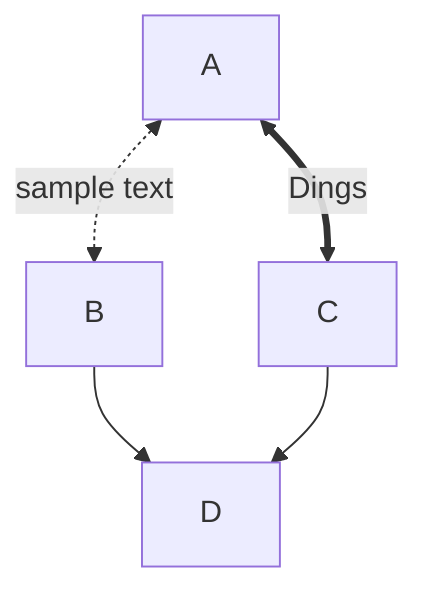
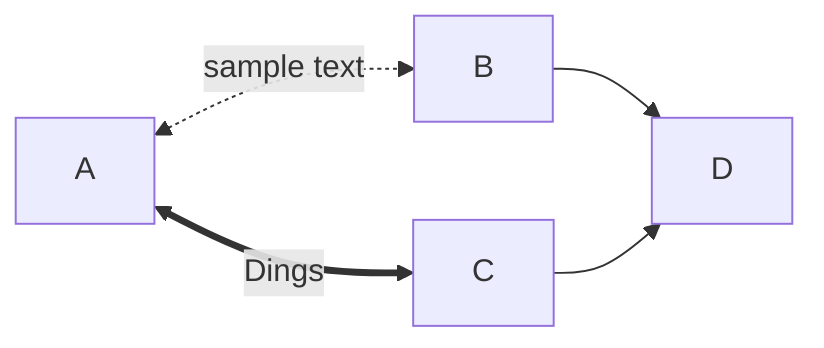
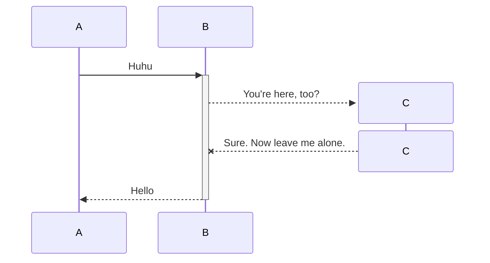

# Samples for Mermaid

## Flowchart Top down

```mermaid
flowchart TD;
	A <-. sample text .-> B;
	A <== Dings ==> C;
	B --> D;
	C --> D;

```

## Flowchart Left right

```mermaid
flowchart LR;
	A <-. sample text .-> B;
	A <== Dings ==> C;
	B --> D;
	C --> D;

```

## Sequence

```mermaid
sequenceDiagram;
	A ->> +B: Huhu
	create participant C
	B -->> C: You're here, too?
	destroy C
	C --x B: Sure. Now leave me alone.
	B -->> -A: Hello


```
